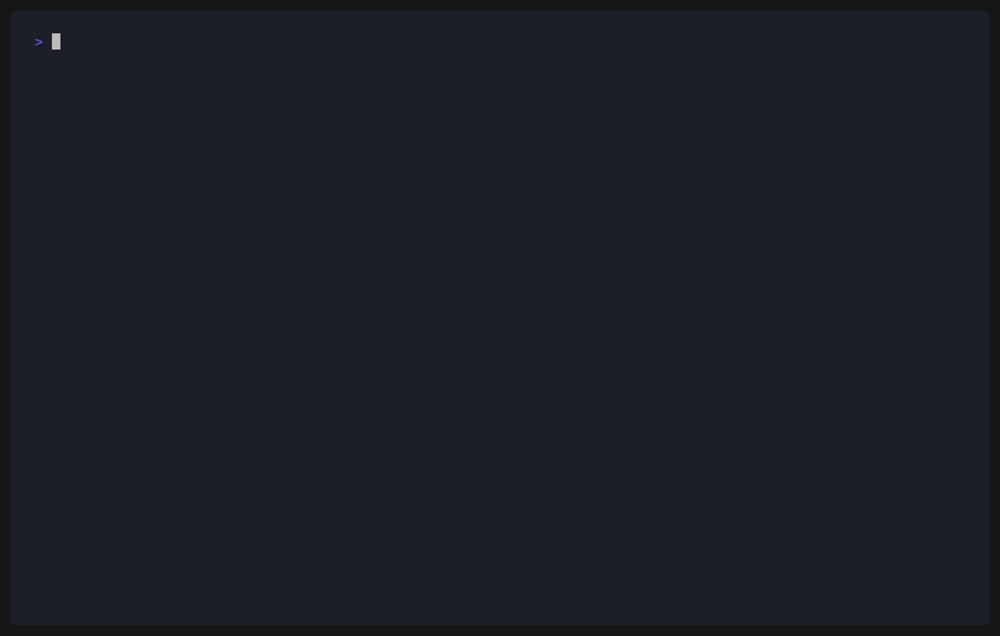

<p align="right"><strong>한국어</strong> · <a href="README.en.md">English</a></p>

<div align="center">
  <h1>k-vote-cli</h1>
  <p><strong>한국 선거 공개 데이터(개표결과·여론조사)를 API 키 없이, 한 명령으로, 구조화된 JSON으로.</strong></p>
  <p>Claude Code · Codex · Cursor · bash · jq · duckdb — AI 에이전트든 사람이든 같은 명령(<code>kvote</code>)으로. 지저분한 CSV/XLSX·robots 차단·인코딩·활용신청 절차를 전부 흡수합니다.</p>
  <p><sub>역대 핵심 개표결과 <strong>동시 다운로드 + 투표구별 정규화</strong> · 여론조사 전수 수집 · 투표율·당선인 OpenAPI · data.go.kr 활용신청 자동화 — <a href="#기능">전체 기능표 ↓</a></sub></p>
</div>

<p align="center">
  
  
  
  
  <a href="LICENSE"></a>
</p>

<p align="center">
  <a href="#quick-start"><strong>Quick Start</strong></a> ·
  <a href="#기능"><strong>기능</strong></a> ·
  <a href="#설치"><strong>설치</strong></a> ·
  <a href="#이걸로-검증할-수-있는-것"><strong>검증 예시</strong></a> ·
  <a href="CLAUDE.md"><strong>내부 구조</strong></a>
</p>

<p align="center">
  
</p>

> [!WARNING]
> 비공식 도구입니다. 공개 포털의 HTML 구조에 의존하므로 사이트 개편 시 동작이 깨질 수 있습니다.
> 수집 대상은 **법적 공개 의무가 있는 공공 데이터**(선거여론조사기준에 따른 등록·공개 자료)이며,
> 기본 rate limit 을 적용해 예의 있게 수집합니다. 본인 책임 하에 사용하세요.

## 무엇을 푸나

선거 개표결과·여론조사는 공개돼 있습니다. 그런데 막상 프로그램으로 가져오려면 벽이 많습니다:

- robots 전면 차단(info.nec.go.kr)·JSF 포털·PDF
- EUC-KR 인코딩, 시트마다 다른 XLSX 레이아웃, 투표구 중복
- data.go.kr OpenAPI 의 활용신청·인증키 발급 절차

`k-vote-cli` 는 이 마찰을 **한 명령**으로 없앱니다. 흩어진 공개 데이터를 — 키 없이 — AI 에이전트가
그대로 질의할 수 있는 구조화된 형태로 만듭니다.

> **중립성.** k-vote-cli 는 원자료를 그대로 보존하고, 정의가 명확한 표준 파생값(투표율·득표율·집계)만
> 계산합니다. 무엇이 정상·비정상인지 **판단하지 않습니다** — 분석과 해석은 데이터를 받은 사용자(또는 AI)의 몫입니다.

## Before → After

| 데이터 | 기존 | k-vote-cli |
|---|---|---|
| **개표결과** (투표구별) | info.nec.go.kr 차단 → data.go.kr 수동 검색 → CSV(EUC-KR) 다운 → 인코딩 변환 → long-format 수작업 파싱·중복 처리 | `kvote nec results <pk>` |
| **역대 핵심 개표결과** | 위 과정을 선거마다 반복 | `kvote nec corpus --normalize` |
| **여론조사** | 게시판 클릭 → 글마다 PDF 다운 → 표 일일이 판독 *(공식 API 없음)* | `kvote nesdc sync` |
| **투표율·당선인** (OpenAPI) | 회원가입 → 활용신청·승인 대기 → 인증키 발급 → 코드 찾기 → XML 호출·페이징·파싱 | `kvote api login` *(1회)* → `kvote nec winners <sgId>` |

## 기능

> 출력은 `-f json|jsonl|table`. **🔑 표시 외 모든 명령은 키 없이 동작**합니다.
> 🔑 = data.go.kr 인증키 필요(`kvote api` 로 자동 발급) · 🧪 = 실험적(키리스 경로 우선).

| 분류 | 기능 | 커맨드 | 키 |
|---|---|---|:--:|
| **⭐ 핵심** | 역대 핵심 개표결과 동시 다운로드 + 투표구별 정규화 | `nec corpus --normalize` | — |
| 개표결과 | 개표결과를 투표구별로 정규화 (집계·본/사전 분리) | `nec results <pk>` | — |
| 개표결과 | 공개 데이터셋 검색 (개표결과 등) | `nec datasets -q <검색어>` | — |
| 개표결과 | 선거종류 최신 회차 자동 해석 | `nec latest <키워드>` | — |
| 개표결과 | 원본 파일 다운로드 (CSV/XLSX 자동) | `nec pull <pk>` | — |
| 여론조사 | 기간/조건 전체를 JSONL 로 전수 수집 | `nesdc sync` | — |
| 여론조사 | 누적 마스터 엑셀 → 정당지지율 (2023.10.30~ 1,400+건) | `nesdc bulk` | — |
| 여론조사 | 단건 상세 메타 + 표본 구성 교차표 | `nesdc show <nttId> --crosstab` | — |
| 여론조사 | 첨부 PDF(통계표·설문지) 다운로드 | `nesdc pull <nttId>` | — |
| 점검 | 킬러 경로 라이브 점검 (사이트 개편 깨짐 감지) | `doctor` | — |
| 🧪 OpenAPI | 투표율 (시도/구시군별, 본/사전 분리) | `nec turnout <sgId> --sgtype N` | 🔑 |
| 🧪 OpenAPI | 당선인 (선거구·기호·정당·이름·득표) | `nec winners <sgId> --sgtype N` | 🔑 |
| 🧪 OpenAPI | 선거코드 레지스트리 (1987~ 모든 sgId·선거종류) | `nec elections` | 🔑 |
| 🧪 계정 | 브라우저 1회 로그인 → 세션 유지 | `api login` | — |
| 🧪 계정 | 내 활용신청 현황 (상태·**만료예정일**) | `api list` | 🔑 |
| 🧪 계정 | OpenAPI 활용신청 자동제출 (목적 필수·확인) | `api apply <pk> --purpose` | 🔑 |

<details>
<summary><strong>주요 옵션 펼치기</strong></summary>

| 커맨드 | 핵심 옵션 |
|---|---|
| `nec corpus` | `--normalize` 받는 즉시 투표구별 JSONL · `-o` 저장 위치 · `--concurrency` |
| `nec results` | `--file` 로컬 파싱 · `--aggregate {town\|sgg\|sido\|national}` · `--by-votetype` · `--race`/`--leaf-only`(XLSX) |
| `nec datasets`/`pull` | `--source datagokr\|openportal` (개방포털: data.nec.go.kr, dataId 사용) |
| `nec turnout`/`winners` | `--sgtype` 1=대통령 2=국회의원 3=시도지사 4=구시군장 5=시도의원 6=구시군의원 · `--api-key`(기본 `KVOTE_DATAGOKR_KEY`) |
| `nesdc sync` | `-q`·`--field`·`--from`/`--to`·`--date-field`·`--gubun`·`--max-pages`·`--pull` |
| `api apply` | `--purpose`(필수) · `--category research\|web\|app\|ref\|etc` · `--yes` |
| `api config` | `--auto-apply true` (확인 없이 바로 신청) |

</details>

### `nec corpus` — 킬러

`nec corpus --normalize` 한 줄이면 역대 핵심 개표결과(대선 제16·17·21대 · 총선·비례 · 지방 5~8회)가
동시 다운로드되고, 받는 즉시 투표구별 JSONL 로 정규화됩니다 — 검증의 "다운로드 + 사전준비"가 한 번에.

```bash
kvote nec corpus --normalize -o ./corpus
duckdb -c "SELECT * FROM read_json_auto('./corpus/*.jsonl') LIMIT 5"
```

### 정규화가 주는 것 (중립 파라미터)

| 차원 | 내용 |
|---|---|
| 투표유형 | 본투표 / 관내사전 / 관외사전 / 거소 — 행마다 분류 |
| 다단계 집계 | 투표구 → 읍면동 → 선거구 → 시도 → 전국 (지표 합산 + 투표율) |
| 파생값 | 투표율(투표/선거인) · 유효투표수(투표−무효) · 후보 득표율(득표/유효) — 정의 명시 |
| 원자료 보존 | 선거인수·투표수·무효·기권·후보별 득표 전부 — 어떤 항등식도 직접 계산 가능 |
| 표본 구성 | 여론조사 성별·연령·지역 × 완료·가중 사례수 + 가중방법 |

### 이걸로 검증할 수 있는 것

`AGENTS.md` 에 에이전트용 레시피가 더 있습니다.

| 검증 | 방법 |
|---|---|
| 사전투표 vs 본투표 득표율 | `nec results --aggregate sgg --by-votetype` |
| 개표 항등식 (투표수 = 후보합 + 무효) | `nec results` → 원자료로 직접 검산 |
| 여론조사 표본 대표성·가중 | `nesdc show --crosstab` |
| 기관×방식별 여론조사 분포 | `nesdc sync` → 전수 집계 |
| 정당지지율 시계열 | `nesdc bulk` |

## 설치

**`go install` (권장)**

```bash
go install github.com/JungHoonGhae/k-vote-cli/cmd/kvote@latest
# 비공개 저장소 동안엔 git 인증 + GOPRIVATE 필요:
#   GOPRIVATE=github.com/JungHoonGhae/* go install github.com/JungHoonGhae/k-vote-cli/cmd/kvote@latest
```

**Homebrew (macOS/Linux)** — 저장소 공개 + tap 준비 후:

```bash
brew install JungHoonGhae/k-vote-cli/kvote
```

**소스 빌드**

```bash
git clone https://github.com/JungHoonGhae/k-vote-cli
cd k-vote-cli
make build        # -> bin/kvote
```

> 크로스플랫폼 바이너리(macOS/Linux/Windows · arm64/amd64)는 태그(`vX.Y.Z`) 푸시 시
> [GitHub Releases](https://github.com/JungHoonGhae/k-vote-cli/releases) 에 goreleaser 로 자동 게시됩니다.

## Quick Start

### For Agent

```text
k-vote-cli 설치: go install github.com/JungHoonGhae/k-vote-cli/cmd/kvote@latest

`kvote doctor` 로 핵심 경로가 살아있는지 먼저 확인.
개표결과는 키 없이 바로 받을 수 있다:
  kvote nec corpus --normalize -o ./corpus   # 역대 핵심 개표결과 → 투표구별 JSONL
  kvote nec results <pk> -f jsonl             # 단일 데이터셋 정규화
출력은 -f jsonl 로 받아 jq/duckdb 로 질의. k-vote-cli 는 데이터만 주고,
정상/이상 판단은 하지 않는다 — 해석은 호출자의 몫.
OpenAPI(turnout/winners)는 키가 필요하나 투표율·당선인은 results 로도 파생 가능.
```

### For Human

```bash
# 핵심 — 역대 개표결과를 한 명령으로
kvote nec corpus --normalize -o ./corpus
duckdb -c "SELECT * FROM read_json_auto('./corpus/*.jsonl') LIMIT 5"

# 단일 데이터셋: 검색 → 정규화
kvote nec datasets -q 개표결과 -f table
kvote nec results 15025527 -f jsonl > votes.jsonl     # 투표구별, 후보 득표 포함
kvote nec results 15025527 --aggregate sgg --by-votetype -f jsonl   # 선거구×투표유형

# 여론조사 — 전수 수집
kvote nesdc sync --from 2026-01-01 > surveys.jsonl
kvote nesdc show 19366 --crosstab -f table            # 단건 상세 + 표본 구성
kvote nesdc bulk -f jsonl > polls.jsonl               # 정당지지율 누적

# data.go.kr OpenAPI — 키 발급부터 호출까지 (실험적)
kvote api login                                       # 브라우저 1회 로그인
kvote api apply 15000900 --purpose "선거 데이터 분석 연구"
export KVOTE_DATAGOKR_KEY=<일반 인증키>
kvote nec winners 20240410 --sgtype 2 -f jsonl        # 제22대 총선 당선인 254명
```

### 필터 (`nesdc sync`)

| 플래그 | 의미 | 값 |
|---|---|---|
| `-q`, `--query` | 검색어 | 자유 문자열 |
| `--field` | 검색 대상 필드 | `agency` `client` `method` `frame` `name` `sido` `regno` |
| `--from` / `--to` | 기간 | `YYYY-MM-DD` |
| `--date-field` | 기간 기준 | `registered`(기본) `published` `surveyed` |
| `--gubun` | 선거구분 | 선거구분 코드 (예: `VT044` 제22대 대선) |

> 포털은 `--date-field` 없이는 기간 필터를 무시합니다 — 기간 지정 시 자동으로 `registered` 를 기본 적용합니다.

### 게시판 (`[board]` 인자)

| name | 내용 |
|---|---|
| `results` | 여론조사결과 보기 (상세 메타 + PDF) — 기본값 |
| `data` | 여론조사결과 주요 데이터 (주차별 벌크) |
| `notices` · `library` · `actions` · `violations` | 공지·자료실·조치현황·위반사례 |

## 출력 형식 · 전역 플래그

| `-f` | 용도 |
|---|---|
| `json` | 기본. 사람이 읽거나 `jq` 로 가공 |
| `jsonl` | 한 줄에 한 레코드. 대량 수집/스트리밍 (jq·duckdb·pandas 바로) |
| `table` | 터미널에서 바로 보기 (한글 폭 정렬) |

| 전역 플래그 | 기본값 | 설명 |
|---|---|---|
| `-f, --format` | `json` | 출력 형식 |
| `--delay` | `700ms` | 요청 간 최소 간격 (rate limit) |
| `--base-url` | — | 포털 base URL 재정의 (테스트용) |

## 데이터 출처

| provider | 사이트 | 내용 | 키 |
|---|---|---|:--:|
| `nec` | 중앙선거관리위원회 → data.go.kr | 개표결과(파일) + 투표율·당선인(OpenAPI) | 파일 — / API 🔑 |
| `nesdc` | 중앙선거여론조사심의위원회 (nesdc.go.kr) | 여론조사 결과·표본 구성 | — |
| `api` | data.go.kr 계정 | OpenAPI 활용신청·인증키·만료 관리 | 🔑 |

`nec` 은 선거통계시스템(info.nec.go.kr)이 robots.txt 로 전면 크롤링을 금지하므로 **직접 스크래핑하지
않습니다.** 대신 선관위가 공식 배포 채널인 **data.go.kr 의 개표결과 파일(CSV/XLSX)** 을 — 키 없이 —
검색·다운로드합니다. `nesdc.go.kr` 은 공식 API 가 없어 스크래핑이 유일한 프로그램적 접근입니다.

## 개발

```bash
make build    # 빌드
make test     # 테스트 (네트워크 불필요 — testdata 픽스처)
make fmt      # gofmt
go vet ./...
```

내부 구조는 [CLAUDE.md](CLAUDE.md), 에이전트 레시피는 [AGENTS.md](AGENTS.md) 참고.

## 라이선스

MIT
